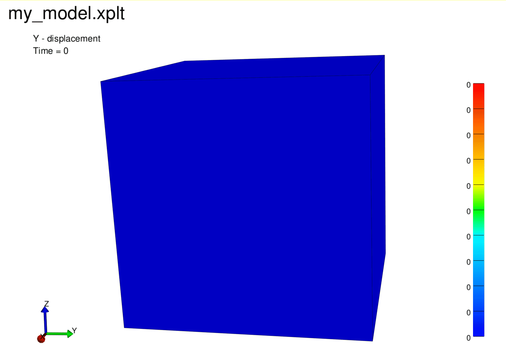

## Overview

This is a Python package for generating FEBio input files.

## Getting Started

- [Installation](#installation)
- [Short Example](#short-example)
- Documentation
- [Features](#features)

## Installation

We will build PyPi packages later. For now, you can install from source:

Clone with https:

```bash
git clone https://github.com/CompOrthoBiomech/pyfebio.git
```

Or,

Clone with ssh:

```bash
git clone git@github.com:CompOrthoBiomech/pyfebio.git
```

**Using uv:**

Install uv from [here](https://docs.astral.sh/uv/getting-started/installation/)

In top-level repository directory:

```bash
uv sync
```

This will create a virtual environment and install the package.

**Using pip:**

In top-level repository directory:

Create a virtual environment:

```bash
python -m venv .venv
```

Activate the virtual environment:

```bash
source .venv/bin/activate
```

Install the package:

```bash
pip install -e .
```

## Short Example

```python
import pyfebio

# Instantiate a model tree with default values
# This contains empty mesh, material, loads, boundary, etc. sections
my_model = pyfebio.model.Model()

# Let's create a single hex8 element explicitly
# Normally, you would use the meshio functions to import
nodes_list = [
    [0.0, 0.0, 0.0],
    [1.0, 0.0, 0.0],
    [1.0, 1.0, 0.0],
    [0.0, 1.0, 0.0],
    [0.0, 0.0, 1.0],
    [1.0, 0.0, 1.0],
    [1.0, 1.0, 1.0],
    [0.0, 1.0, 1.0],
]

elements_list = [[1, 2, 3, 4, 5, 6, 7, 8]]

# Add Nodes to an pyfebio.Nodes object
nodes = pyfebio.mesh.Nodes(name="nodes")
for i, node in enumerate(nodes_list):
    nodes.add_node(pyfebio.mesh.Node(id=i + 1, text=",".join(map(str, node))))

# Add Elements to an pyfebio.Elements object
elements = pyfebio.mesh.Elements(name="box", type="hex8")
for i, element in enumerate(elements_list):
    elements.add_element(pyfebio.mesh.Hex8Element(id=i + 1, text=",".join(map(str, element))))

# Append nodes and elements to the model's mesh section
my_model.mesh.nodes.append(nodes)
my_model.mesh.elements.append(elements)

# Let's make a node set for top and bottom
bottom_nodes = [1, 2, 3, 4]
top_nodes = [5, 6, 7, 8]
top_node_set = pyfebio.mesh.NodeSet(name="top", text=",".join(map(str, top_nodes)))
bottom_node_set = pyfebio.mesh.NodeSet(name="bottom", text=",".join(map(str, bottom_nodes)))

# Append the node sets to the model's mesh section
my_model.mesh.node_sets.append(top_node_set)
my_model.mesh.node_sets.append(bottom_node_set)

# We need a material
# the use of pyfebio.material.MaterialParameter is our solution
# to handle mapped, math, or directly specified values
my_material = pyfebio.material.MooneyRivlin(
    id=1,
    name="cartilage",
    c1=pyfebio.material.MaterialParameter(text=10.0),
    c2=pyfebio.material.MaterialParameter(text=1.0),
    k=pyfebio.material.MaterialParameter(text=1000.0),
)

# Define a solid domain for the box to assign the material
solid_domain = pyfebio.meshdomains.SolidDomain(name="box", mat="cartilage")

# add the solid domain
my_model.mesh_domains.add_solid_domain(solid_domain)

# add the material
my_model.material.add_material(my_material)

# Fix the bottom nodes (1 means BC DoF is active)
fixed_bottom = pyfebio.boundary.BCZeroDisplacement(node_set="bottom",
                                                   x_dof=1,
                                                   y_dof=1,
                                                   z_dof=1)

# Displace the top nodes in z
# We need to create a boundary.Value object that references a load curve
displacement_value = pyfebio.boundary.Value(lc=1, text=-0.2)
move_top = pyfebio.boundary.BCPrescribedDisplacement(
    node_set="top", dof="z", value=displacement_value
)

# Add boundary conditions
my_model.boundary.add_bc(fixed_bottom)
my_model.boundary.add_bc(move_top)

# Now, create the loadcurve 1 we referenced
curve_points = pyfebio.loaddata.CurvePoints(points=["0.0,0.0", "1.0,1.0"])
load_curve1 = pyfebio.loaddata.LoadCurve(id=1, points=curve_points)
# And, add it to model
my_model.load_data.add_load_curve(load_curve1)

# Finally, save the model to disk
my_model.save("my_model.feb")
```

Run the model from the CLI (assuming febio4 is on your PATH):

```{bash}
febio4 -i my_model.feb
```




## Features

Brief overview, see module documentation for more details. Unchecked are not yet implemented.

- Control
  - [x] All control settings
- Mesh Section
  - [x] Nodes
  - [x] Solid Elements:
     - tet4, tet10, hex8, hex20, hex27, penta6
  - [x] Shell Elements:
     - tri3, tri6, quad4, quad8, quad9, q4ans, q4eas
  - [x] Beam Elements:
     - line2, line3
  - [x] Node, Element, Surface Sets
- MeshDomain
  - [x] Solid, Shell, and Beam Domains
  - [x] Granular control for integration schmemes, etc.
- MeshData Section
  - [x] Node Data
    - [x] Scalar
    - [x] Vector3
  - [x] Element Data
    - [x] Scalar
    - [x] Vector3
  - [x] Surface Data
    - [x] Scalar
    - [x] Vector3
- Material
  - [x] Most Unconstrained Formulation Materials
  - [x] Most Uncoupled Formulation Materials
  - [x] Prestrain Material
  - [x] Fiber models
  - [x] Material Axis
    - [x] Vector Definition
    - [ ]
  - [x] Continuous Fiber Distributions
    - [x] Integration Schemes
  - [x] Element-wise, mapped, or math parameter defintion
  - [ ] Biphasic Materials
  - [ ] Viscoelastic Materials
  - [ ] Multiphasic Materials
  - [ ] Biphasic-solute Materials
  - [ ] Chemical Reactions
  - [ ] Active Contraction Materials
  - [ ] Damage Materials
  - [ ] First-order Homogenization
- Rigid
  - [x] Fixed Displacement and Rotation
  - [x] Prescribed Displacement and Rotation
  - [x] Precribed Rotation about Vector
  - [x] Prescribed Euler Rotation
  - [x] All Connectors
  - [x] Follower Loads
- Initial
  - [x] Initial Velocity
  - [x] Initial Pre-strain
- Loads
  - [x] Nodal Loads
  - [x] Traction Loads (surface)
  - [x] Pressure Loads (surface)
  - [x] Fluid Flux (surface)
  - [x] Fluid Pressure (surface)
- LoadData
  - [x] Load Curves
    - [x] All Options
  - [x] PID Controllers
  - [x] Math Controllers
- Boundary
  - [x] Fixed Displacement (solid and shell)
  - [x] Prescribed Displacement (solid and shell)
  - [x] Precribed Deformation Gradient
  - [x] Displacment Along Normals
  - [x] Fix to Rigid Body
  - [x] Rigid Node Set Deformation (translation and rotation)
  - [x] Zero Fluid Pressure
  - [x] Prescribed Fluid Pressure
- Constraints
  - [x] Symmetry Plane
  - [x] Prestrain
  - [x] In-Situ Stretch
- Contact
  - [x] Sliding
    - [x] Elastic
    - [x] Facet-Facet
    - [x] Node-Facet
    - [x] Biphasic
    - [x] Sliding2
    - [x] Contact Potential Formulation
  - [x] Tie
    - [x] Elastic
    - [x] Facet-Facet
    - [x] Node-Facet
    - [x] Biphasic
- Step
  - [x] Multistep Analysis
- Output
  - [x] Log File Configuration
  - [x] Plot File Configuration
  - [x] Node Variables
  - [x] Element Variables
  - [x] Rigid Body Variables
  - [x] Rigid Connector Variables
