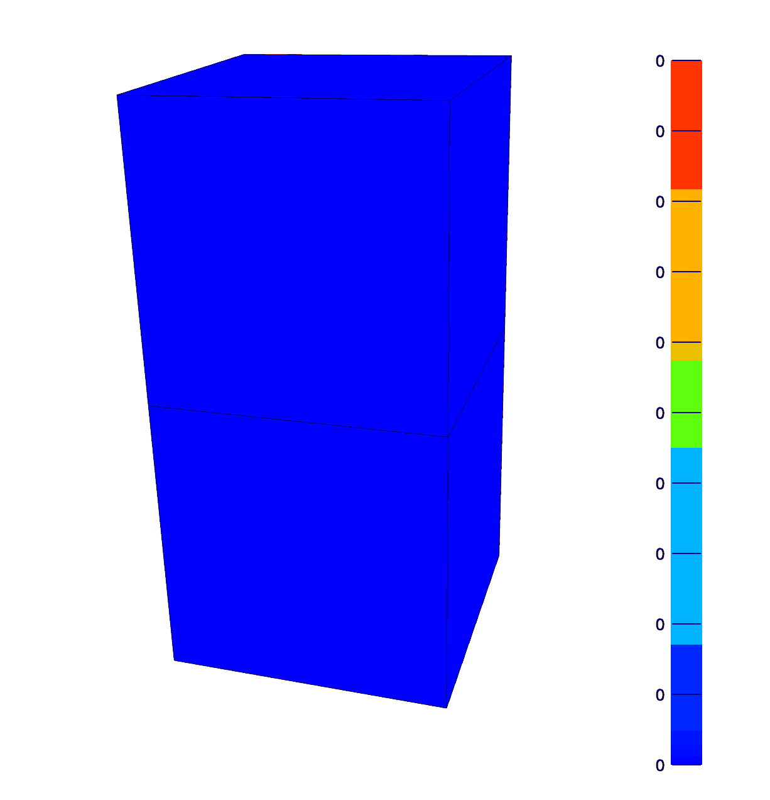
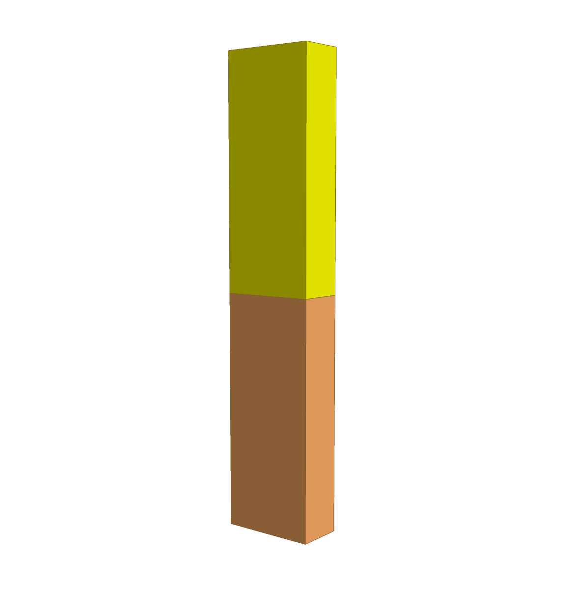

Examples
========

.. _elastic_hex20:

Elastic Hex20
-------------

This example demonstrates how to convert a mesh from gmsh format
to a meshio object and then translate that to a pyfebio mesh. The
element and surface sets defined in the gmsh file are translated to lists of
pyfebio **Elements** and **Surfaces**. Node sets are also created from the surfaces.
A pyfebio **Model** is then instantiated with default values other than the mesh, which is
specified as our translated mesh.

Each **Elements** object represents a part. We loop over these parts and assign a **NeoHookean** material
and a **SolidDomain** to each. We assign a **BCZeroDispacement** boundary condition to the "bottom" node sets
with all degrees of freedom active (fixing the bottom nodes in space).

We twist the top face by applying a **BCRigidDeformation**. The **pos** argument is a point on the axis of
rotation, the **rot** argument is the rotation axis (its magnitude is the rotation angle, in this case :math:`\pi` radians).

.. literalinclude:: ../src/examples/elastic_hex20.py
    :language: python

    The maximum Green-Lagrange shear strain after twisting the top face by :math:`\pi` radians. Note the top layer is 2X stiffer than the bottom layer.

Biphasic Hex20
--------------

Most steps are similar to the :ref:`elastic_hex20` example. We instead instantiate
a pyfebio **BiphasicModel**, which sets the module to "biphasic", the analysis to "TRANSIENT",
and the solver type to "biphasic". We assign a **BiphasicMaterial** with a **NeoHookean** solid phase
and **ConstantIsoPerm** as the permeability. The bottom nodes are fixed in space, a **BCZeroFluidPressure** boundary
condition to allow free-draining on the top surface, and a **BCPrescribedDisplacement** in the z direction for
the top nodes.

.. literalinclude:: ../src/examples/biphasic_hex20.py
    :language: python

    The effective fluid pressure after compressing the top face by 0.5mm in 0.1 seconds and then holding for 9.9 seconds. Note that
    the top element has twice the permeability of the bottom, hence the asymmetry in fluid pressure and deformation.

Sliding Contact
---------------

This example demonstrates sliding contact. This requires the definition of a **SurfacePair**, which is
then referenced in the **SlidingElastic** contact definition. We enforce the contact constraint with the
augmented Lagrange multiplier method by setting *laugon="AUGLAG"*. We also set *two_pass=1*, which helps
reduce penetration at the sharp edges of this very coarse mesh.

.. literalinclude:: ../src/examples/contact.py
    :language: python

.. figure:: _static/contact.gif
    :width: 400px
    :align: center

    The z-displacement resulting from the contact simulation. Note the nodal penetration near the sharp edge due to the coarse mesh size.
    This is more severe if the penalty method is used or two_pass is turned off.

Adaptive Remeshing
------------------

FEBio has several implementations of adaptive remeshing. This example demonstrates an adaptor that will refine a hex8 mesh to reduce the stress error in the bottom-layer.

.. literalinclude:: ../src/examples/mesh_adapt.py
    :language: python

.. figure:: _static/meshadapt.gif
    :width: 400px
    :align: center

    The hex mesh adaptively refines to reduce the stress error in the bottom-layer. Note the greatest refinement occurs
    at the necking corners.

Three Cylinder Joint
--------------------

This example demonstrates the use of rigid connectors to create a three cylinder linkage, which is a popular approach to modeling joint dynamics.

.. literalinclude:: ../src/examples/three_cylinder_joint.py
    :language: python

    Enforcing :math:`\pm \frac{\pi}{2}` radian rotations about the flexion-extension, varus-valgus, and internal-external rotation axes, and :math:`\pm 1.0` inferior-superior, medial-lateral, and anterior-posterior translations
    with rigid connectors. The GhostA and GhostB rigid bodies are hidden.
